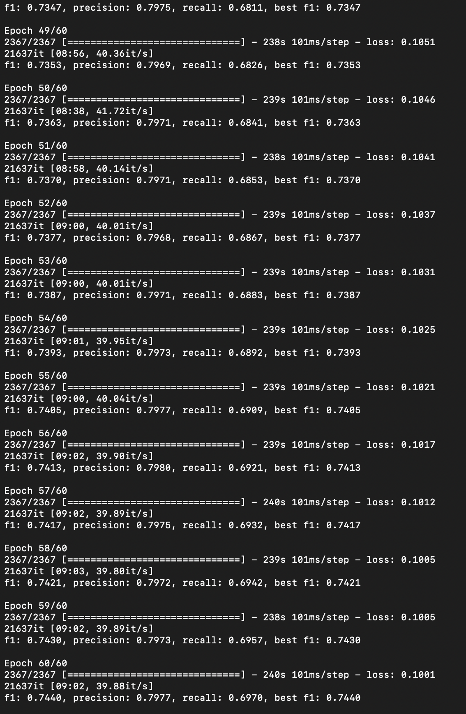
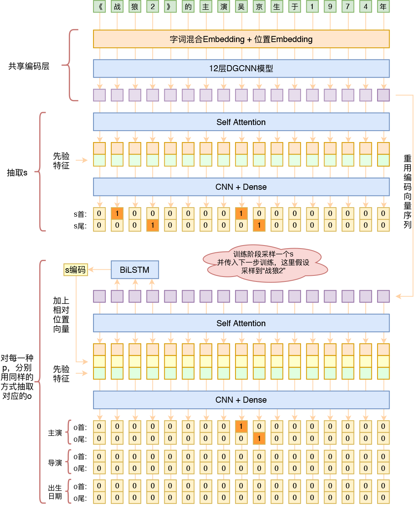

# 使用DGCNN做联合三元组抽取
## 此版本为本人注释学习版本

源链接：https://github.com/bojone/kg-2019

基于keras==2.2.4 ft==1.13.1 python3.7

数据集为百度2019信息抽取数据

```
python data_trans.py
python kg_extract.py
```

注意模型的构建GRU部分，需要选择是CPU还是GPU

```python 
# k = Bidirectional(CuDNNGRU(t_dim))(k)
k = Bidirectional(GRU(t_dim))(k)
```

在实验室2080的机器上，跑了13个小时，达到0.744的f1





数据集和词向量太大，需要额外下载
```bibtex
链接: https://pan.baidu.com/s/18GPchKhhqcDuD1zVJAPAgQ  密码: 2d1l
```


